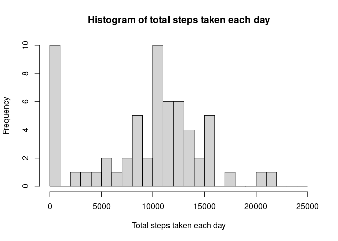
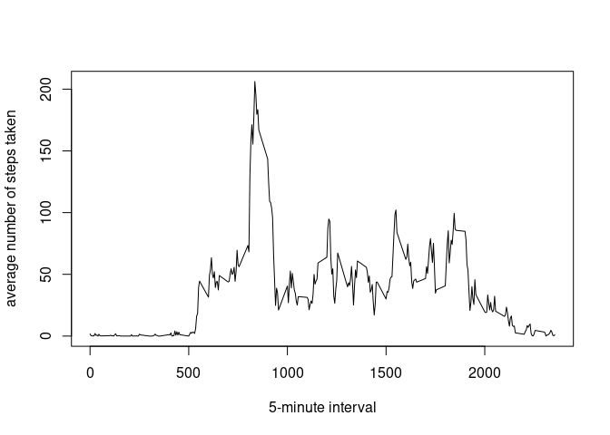
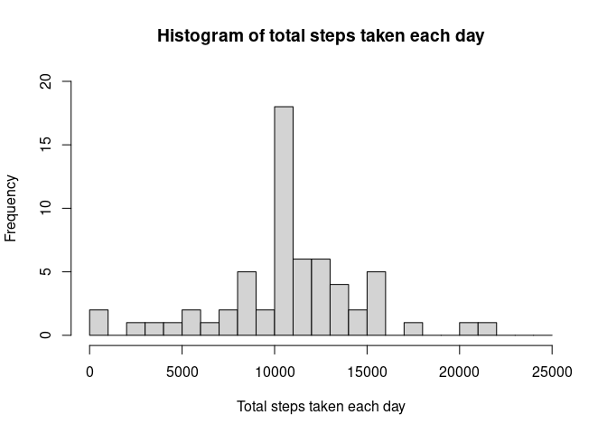
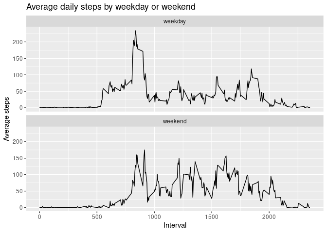

## Loading and preprocessing the data


```r
unzip("activity.zip")
activity <- read.csv("activity.csv")
```

## What is mean total number of steps taken per day?


```r
totalSteps <- tapply(activity$steps, activity$date, FUN = sum, na.rm = T)
summary(totalSteps)
```

```
##    Min. 1st Qu.  Median    Mean 3rd Qu.    Max. 
##       0    6778   10395    9354   12811   21194
```

```r
hist(totalSteps, main = "Histogram of total steps taken each day", xlab = "Total steps taken each day", 
     breaks = seq(0, 25000, by = 1000))
```

<!-- -->

```r
mean(totalSteps, na.rm = T)
```

```
## [1] 9354.23
```

```r
median(totalSteps, na.rm = T)
```

```
## [1] 10395
```

## What is the average daily activity pattern?


```r
average <- aggregate(x = list(steps = activity$steps), by = list(interval = activity$interval), FUN = mean, 
                     na.rm = T)
plot(average$interval, average$steps, type = "l", xlab = "5-minute interval", 
     ylab = "average number of steps taken")
```

<!-- -->

```r
average[which.max(average$steps),]$interval
```

```
## [1] 835
```

## Imputing missing values


```r
sum(is.na(activity$steps))
```

```
## [1] 2304
```

```r
imputedSteps <- average$steps[match(activity$interval, average$interval)]
activityImputed <- transform(activity, steps = ifelse(is.na(activity$steps), yes = imputedSteps, 
                                                      no = activity$steps))
totalStepsImputed <- aggregate(steps ~ date, data = activityImputed, FUN = sum, na.rm = T)
hist(totalStepsImputed$steps, main = "Histogram of total steps taken each day", 
     xlab = "Total steps taken each day", breaks = seq(0, 25000, by = 1000), ylim = c(0, 20))
```

<!-- -->

```r
mean(totalStepsImputed$steps)
```

```
## [1] 10766.19
```

```r
median(totalStepsImputed$steps)
```

```
## [1] 10766.19
```

## Are there differences in activity patterns between weekdays and weekends?


```r
activity$date <- as.Date(activity$date)
activity$dateType <- sapply(activity$date, function(x) {
    if (weekdays(x) == "Saturday" | weekdays(x) == "Sunday") 
        y <- "weekend"
    else 
        y <- "weekday"
})
averageByDate <- aggregate(steps ~ interval + dateType, activity, FUN = mean, na.rm = T)

library(ggplot2)
ggplot(averageByDate, aes(x = interval , y = steps)) +
    geom_line() +
    labs(title = "Average daily steps by weekday or weekend", x = "Interval", y = "Average steps") +
    facet_wrap( ~ dateType, nrow = 2)
```

<!-- -->
